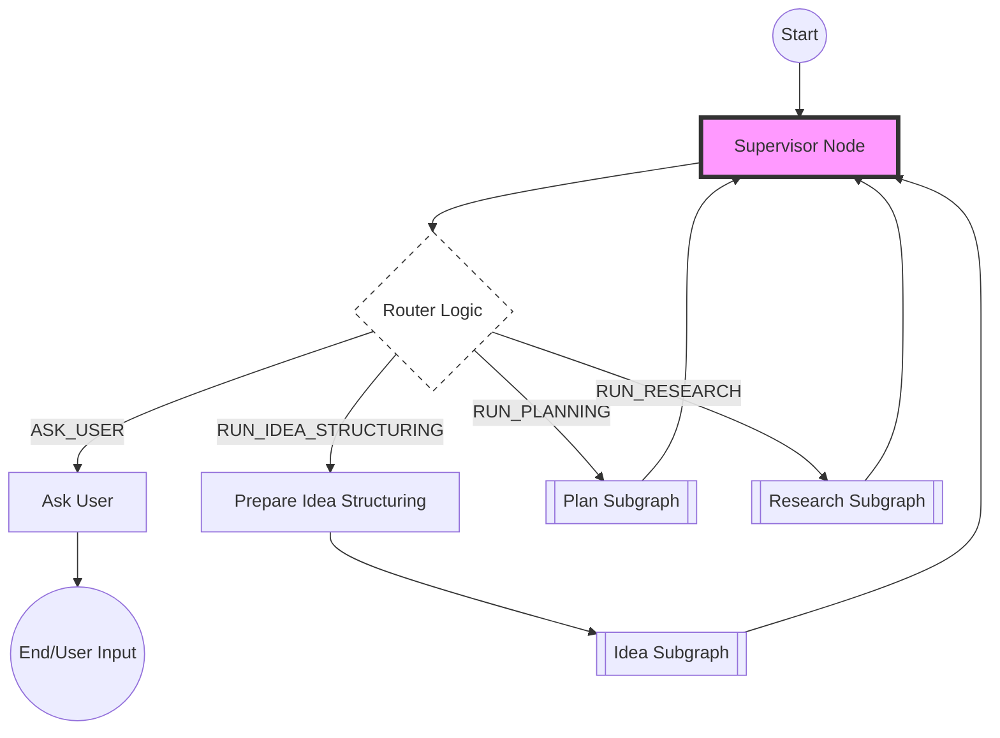
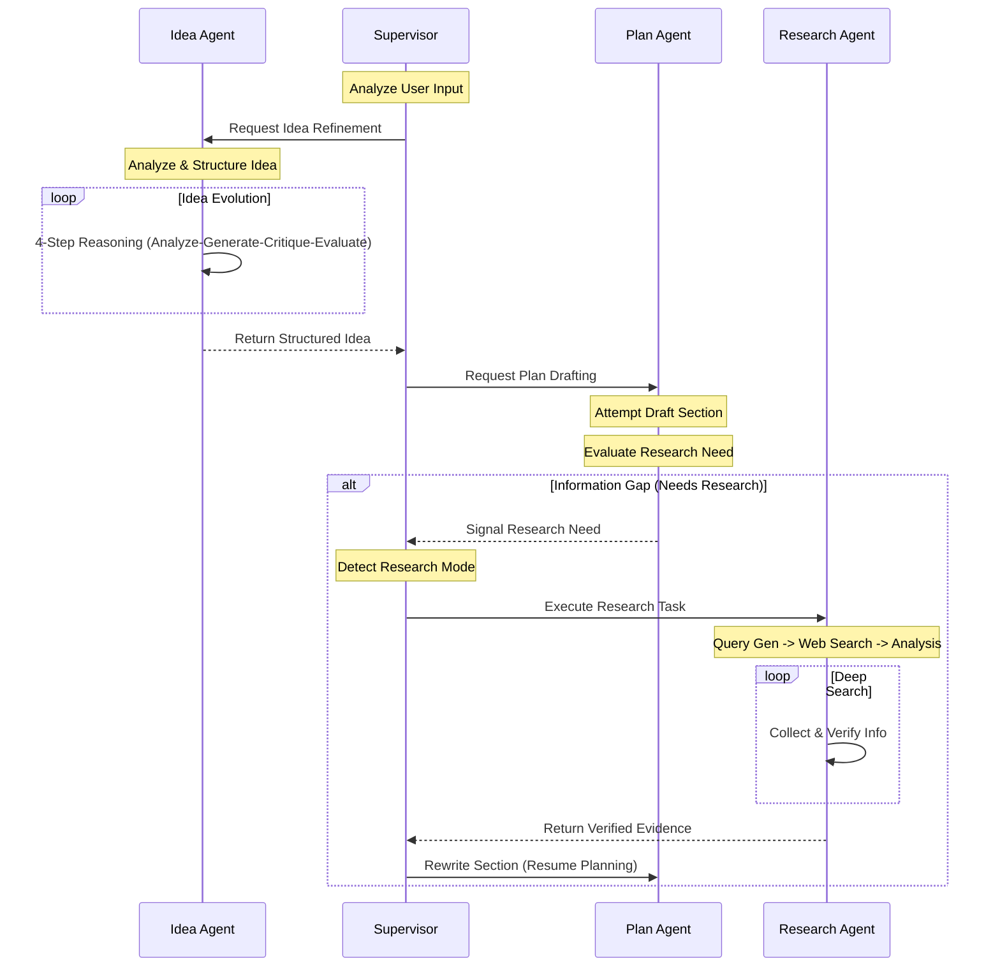

# DIV(Design In Vibe): AI-Powered Agentic Writing Assistant

**DIV(Design In Vibe)** is an advanced AI agent system designed to transform abstract user ideas into concrete, comprehensive project plans and documents. Built with **LangGraph** and **Streamlit**, it orchestrates a team of specialized agents—Idea, Plan, Research, and Visual—under a central Supervisor to collaboratively author high-quality content.

---

## 🚀 Key Features

- **Multi-Agent Orchestration**: A Supervisor agent intelligently routes tasks to specialized sub-agents based on user intent.
- **Idea Structuring**: Transforms vague inputs into structured blueprints with clear objectives and scope.
- **Deep Research**: Autonomous research agent performs web searches (Tavily/DuckDuckGo) to gather evidence and validate claims.
- **Visual Generation**: Automatically generates data visualizations (Charts, Mermaid diagrams) to support the content.
- **Incremental Writing**: Generates long-form documents section by section, ensuring coherence and depth.
- **Interactive UI**: User-friendly Streamlit interface for real-time interaction and feedback.

---

## 🏗️ System Architecture

### 1. Supervisor Graph (Central Control)
The **Supervisor** serves as the central control unit, analyzing user input and routing tasks to the appropriate sub-agents.



### 3. Interaction Sequence Diagram
This sequence diagram illustrates the detailed interaction flow between the Supervisor and the Agents.



---

## 🛠️ Installation

This project is managed with **[uv](https://github.com/astral-sh/uv)**, a fast Python package installer and resolver.

### 1. Clone the repository
```bash
git clone https://github.com/boostcampaitech8/pro-nlp-finalproject-nlp-04.git
cd pro-nlp-finalproject-nlp-04
```

### 2. Install dependencies
Ensure you have `uv` installed. If not, install it first:
```bash
pip install uv
```

Then, sync the project dependencies:
```bash
uv sync
```

---

## ⚙️ Configuration

Create a `.env` file in the root directory and add your API keys. Refer to `src/config/config.py` for variables.

```ini
# .env
UPSTAGE_API_KEY=your_solar_pro_api_key
TAVILY_API_KEY=your_tavily_api_key
```

---

## ▶️ Usage

Run the Streamlit application using `uv`:

```bash
uv run streamlit run src/main.py
```

The application will open in your default browser. You can start by entering a topic or idea in the chat input.

---

## 📂 Project Structure

```
.
├── src/
│   ├── agents/           # Agent implementations (Supervisor, Idea, Plan, Research, Visual)
│   ├── config/           # Configuration and environment variables
│   ├── front/            # Streamlit UI components
│   ├── graph/            # LangGraph state definitions
│   ├── models/           # LLM model wrappers
│   ├── prompts/          # System prompts for agents
│   └── state/            # State schema definitions
├── exp/                  # Experiments and test scripts
├── output/               # Generated documents and artifacts
├── pyproject.toml        # Project dependencies and settings
└── README.md             # Project documentation
```

---

## 🤝 Contribution

1. Fork the Project
2. Create your Feature Branch (`git checkout -b feat/AmazingFeature`)
3. Commit your Changes (`git commit -m 'Add some AmazingFeature'`)
4. Push to the Branch (`git push origin feat/AmazingFeature`)
5. Open a Pull Request
