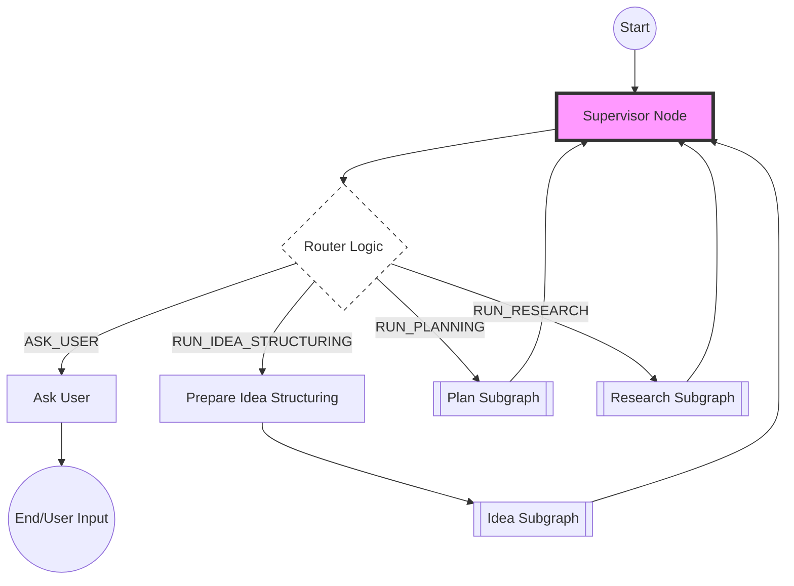
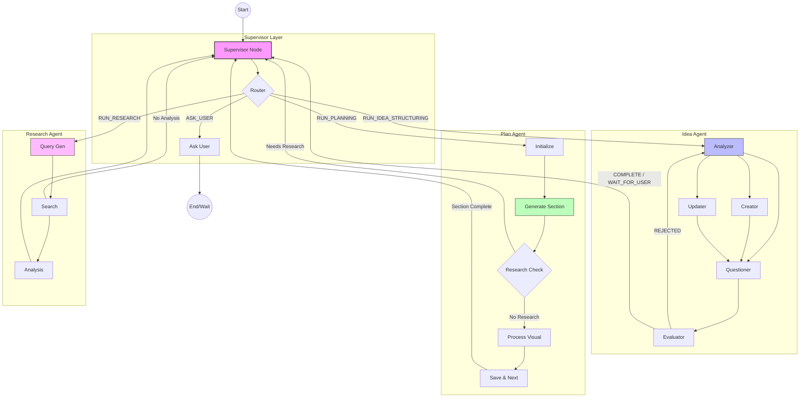

# Vibe Planner: AI-Powered Planning Assistant

## 1. System Overview
Vibe Planner는 사용자의 아이디어를 구체적인 기획서로 변환해주는 AI 에이전트 시스템입니다. Supervisor 에이전트를 중심으로 Idea, Plan, Research, Visual 에이전트가 유기적으로 협력하여 문서를 작성합니다.

---

## 2. Supervisor Graph (Central Control)
Supervisor는 사용자의 입력을 분석하고 적절한 하위 에이전트로 작업을 라우팅하는 중앙 제어 장치입니다.

---

## 3. Overall State Transition Diagram
전체 시스템의 상태 전이와 에이전트 간의 상호작용 흐름도입니다.

