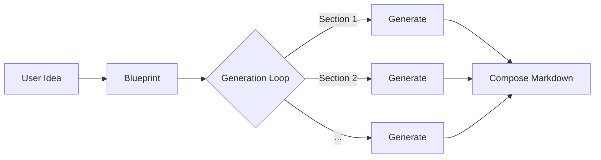
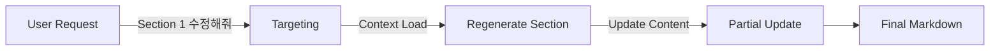

# Pro NLP Final Project 04

## 🧪 Experiment: Partial Update Architecture (Section Regeneration)

기획서 생성 시스템의 유연성을 높이기 위해, 전체 문서를 재생성하지 않고 특정 섹션만 수정하는 **'Partial Update(부분 수정)'** 아키텍처를 실험 중입니다.

### 1. Pipeline Comparison

기존의 생성 파이프라인과 실험 중인 편집 파이프라인의 구조적 차이는 다음과 같습니다.

#### A. Generation Pipeline (Creation Track)
전체 Blueprint를 기반으로 순차적으로 모든 섹션을 생성합니다.

#### B. Editing Pipeline (Editing Track)
유저가 지목한 특정 섹션만 타겟팅하여 재생성합니다.

### 2. Expected Benefits (기대 효과)

1.  **Efficiency (효율성)**: 수정이 필요한 부분만 LLM을 호출하므로 토큰 비용과 대기 시간이 획기적으로 감소합니다.
2.  **Context Preservation (맥락 유지)**: 수정을 원하지 않는 다른 섹션들의 내용은 100% 원본 그대로 유지됩니다.
3.  **Responsiveness (반응성)**: 유저의 피드백을 즉각적으로 반영하여 '대화하며 고쳐나가는' UX를 제공할 수 있습니다.

### 3. Experiment Progress (실험 경과)

- [x] **Architecture Design**: `Generation` 트랙과 `Editing` 트랙을 분리하는 Dual Track 구조 설계 완료.
- [x] **MVP Implementation**: 단일 섹션 재생성(`Regeneration`) 기능 구현 (`exp/edit` 브랜치).
    - `EditState`: 편집 전용 경량 상태 정의.
    - `EditGraph`: 단일 노드 기반의 심플한 워크플로우.
    - `Instruction Injection`: 기존 생성 로직을 재사용하되, 유저 요청을 가이드라인에 주입하는 기법 검증.
- [x] **Verification**: `test_edit_MVP.py`를 통해 특정 섹션("AI의 장점")에 반론("에너지 소모 단점")을 추가하는 시나리오 성공.

---
> **Note**: 현재 `exp/edit` 브랜치에서 실험이 진행되고 있습니다.
