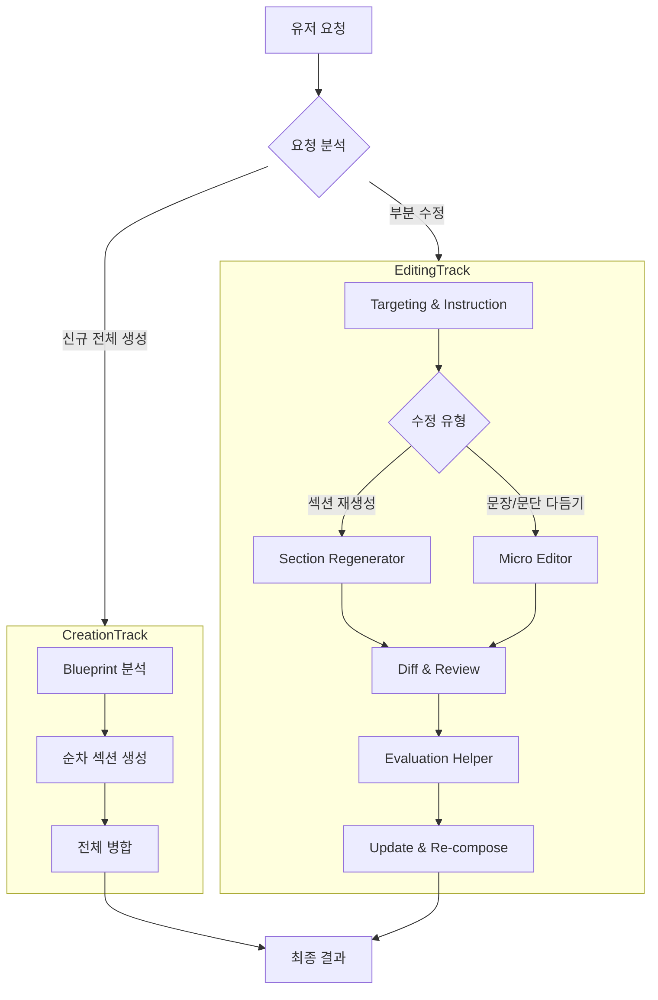

# 부분 문서 수정을 위한 에이전트 아키텍처 제안 (v2)

기존 파이프라인(전체 루프)과 차별화된 **'편집 트랙(Editing Track)'**을 신설하여, 유저의 부분 수정 요청을 효율적으로 처리합니다.
유저 피드백을 반영하여 State 구조 개선, 검증(Evaluation) 단계 추가, 그리고 모듈 분리 방안을 구체화했습니다.

## 1. 아키텍처 개요: Dual Track

요청의 성격에 따라 두 가지 파이프라인 중 하나로 라우팅합니다.



## 2. State & Data Structure 설계

**핵심 변경**: `GlobalState`의 `sections`가 단순 `List[str]`이면 타겟팅이 어렵습니다. 이를 ID와 메타데이터를 포함한 `List[Dict]` 형태로 통일할 것을 제안합니다.

### A. GlobalState (Base State) 수정 제안
```python
class PlanState(TypedDict):
    # 기존: sections: Annotated[List[str], '생성된 섹션 본문 리스트']
    # 변경: ID 기반 관리를 위해 Dict 구조로 변경
    sections: Annotated[List[Dict[str, Any]], '섹션 리스트 (id, title, content, visual_idx 등)'] 
    final_markdown: Annotated[str, '합쳐진 전체 마크다운 문자열']
    # ...
```

### B. PlanPipelineState (Internal) 확장
편집 작업에 필요한 임시 필드들을 추가합니다.

```python
class PlanInternalState(GlobalState):
    # ... 기존 필드 ...
    
    # [Editing Extensions]
    target_section_id: str | None       # 수정 대상 섹션 ID
    edit_instruction: str | None        # 구체적 수정 지침 ("이 문단 좀 더 부드럽게")
    edit_type: str                      # 'regenerate' (전체) vs 'refine' (부분)
    
    original_content: str | None        # 수정 전 내용 (Diff 생성용)
    revised_content: str | None         # 수정 후 내용 (후보)
    
    evaluation_result: Dict[str, Any]   # (Optional) 변경 관련 평가 결과
```

## 3. 상세 프로세스 (Editing Flow)

### Step 1: Targeting (타겟 식별)
*   **Input**: 유저의 자연어 요청, 현재 `sections` 리스트 (Metadata 포함)
*   **Logic**: LLM이 유저 요청이 가리키는 섹션을 찾아 `target_section_id`를 설정합니다.
*   **Note**: `sections`가 구조화되어 있어야 정확도가 높습니다.

### Step 2: Context Loading & Routing
*   **Context**: 타겟 섹션의 `content`, 앞뒤 섹션의 `summary`(또는 `title`), 그리고 전체 `Blueprint`.
*   **Routing**:
    *   **Regenerate**: "내용이 부족해", "다시 써줘" -> 아예 섹션을 새로 씁니다 (Drafting Agent 재사용 가능).
    *   **Refine**: "말투가 딱딱해", "첫 문장만 고쳐줘" -> 기존 텍스트를 `rewrite` 합니다 (Editing Agent).

### Step 3: Editing (The Editor Agent)
*   **Role**: 전문 교정자/에디터.
*   **Prompting**:
    *   **Input**: `Original Text`, `User Instruction`, `Context(Blueprint)`
    *   **Task**: "Guideline: Apply the user's instruction to the text. Do NOT change the core meaning defined in the Blueprint unless asked."
*   **IdeaAgent 협력**: 만약 수정 요청이 "주제를 바꿔줘" 처럼 Blueprint를 거스르는 경우, `IdeaAgent`를 호출하여 Blueprint 수정부터 다시 밟아야 할지 판단하는 로직이 이상적이나, **초기 구현에서는 Editor가 Blueprint 범위를 넘지 않도록 제약**하는 것이 복잡도를 줄이는 길입니다.

### Step 4: Diff & Review (Acceptance)
*   곧바로 덮어쓰기보다, 수정 전/후를 비교합니다. 추후 UI에서 "변경 사항 보기" 기능을 지원하기 위함입니다.
*   단순 구현: `original_content`와 `revised_content`를 모두 저장해둡니다.

### Step 5: Evaluation (Interface)
*   현재 자동 평가 로직이 없더라도, 파이프라인상에 `Evaluation Node` 자리를 만들어둡니다.
*   **역할**: 수정된 내용이 Blueprint의 의도를 벗어나지 않았는지(Consistency Check), 문법 오류는 없는지 확인.
*   **Implementation**: 지금은 `pass`만 하는 더미 노드로 두고, 나중에 `ValidatorAgent`를 연결합니다.

### Step 6: Merging
*   `sections` 리스트에서 해당 ID의 객체를 찾아 `content`를 업데이트합니다.
*   `final_markdown`을 다시 조합(join)합니다.

## 4. 모듈 구조 제안 (Module Structure)

기능별 응집도를 높이고 확장성을 가지기 위해 다음과 같은 디렉토리 구조를 제안합니다.

```text
src/agents/plan/
├── pipeline/           # 그래프 정의 (StateGraph), 파이프라인 오케스트레이션
│   ├── creation.py     # (구 pipeline.py) 생성 파이프라인
│   └── editing.py      # [NEW] 편집 파이프라인
├── generators/         # [Renamed from nodes?] 생성 관련 노드 로직
│   ├── drafting.py     # 섹션 초안 작성
│   └── layout.py       # 목차/구조 잡기
├── editors/            # [NEW] 편집 관련 노드/로직
│   ├── targeting.py    # 섹션 식별
│   └── refiner.py      # 문장/문단 교정
├── visual/             # 시각화 관련 (기존 유지)
│   ├── decision.py
│   └── generator.py
└── utils/              # 공통 유틸 등
```

**"plan_core/visual", "generate", "edit"** 로 나누는 유저의 제안도 훌륭하며, 위 구조는 그 의도를 반영하여 코드 레벨에서 구체화한 것입니다.

## 5. Action Plan

1.  **State Migration**: `src/state/base.py`의 `PlanState` 내 `sections` 타입을 `List[Dict]`로 변경 (하위 호환성 주의).
2.  **Refactoring**: 기존 `nodes.py`의 비대한 로직을 `generators/`, `visual/` 등으로 분산.
3.  **New Agent**: `src/agents/plan/editors/` 패키지 생성 및 `Targeting`, `Refining` 로직 구현.
4.  **Graph Update**: `plan_graph.py`에 `edit_workflow` 서브그래프 추가.
