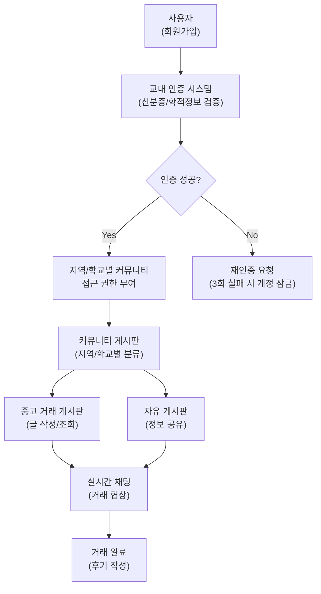

# 서비스 개요

> 사용자 아이디어는 대학생이라는 특정 타겟층을 기반으로 한 플랫폼 서비스로, 시장성 분석과 수익 모델 설계가 핵심입니다. Business 스타일을 선택해 시장 구조, 경쟁 우위, 운영 효율성, 재무적 타당성을 종합적으로 다루기 위함입니다.

*생성 방법: blueprint*

---

## 목차

- [1. 서비스 개요](#1-서비스-개요)
- [2. 시장 분석 및 타겟층 정의](#2-시장-분석-및-타겟층-정의)
- [3. 비즈니스 모델 및 수익 구조](#3-비즈니스-모델-및-수익-구조)
- [4. 경쟁사 분석 및 차별화 전략](#4-경쟁사-분석-및-차별화-전략)
- [5. 운영 계획 및 기술 인프라](#5-운영-계획-및-기술-인프라)
- [6. 마케팅 전략 및 고객 유치 방안](#6-마케팅-전략-및-고객-유치-방안)
- [7. 재무 계획 및 성장 전략](#7-재무-계획-및-성장-전략)

---

## 1. 서비스 개요

대학생 전용 중고 거래 플랫폼으로, 교내 인증 시스템을 통해 신뢰도를 강화하고 지역/학교별 커뮤니티 기능을 강조한 앱 서비스

#### 🔀 시각화: 서비스 구조, 주요 기능(교내 인증 시스템, 지역/학교별 커뮤니티), 사용자 흐름을 시각적



> **시각화 목적**: 서비스 구조, 주요 기능(교내 인증 시스템, 지역/학교별 커뮤니티), 사용자 흐름을 시각적으로 표현하여 복잡한 관계를 직관적으로 이해하기 위해
> **형식 선택 이유**: 시스템 아키텍처와 구성 요소 간 상호작용을 명확하게 보여주기 위해 다이어그램 형식이 가장 적합하며, 텍스트만으로는 전달이 어려운 공간적 관계를 효과적으로 시각화할 수 있기 때문
> **데이터 출처**: 서비스 설계 문서 및 시스템 아키텍처 계획 기반

## 2. 시장 분석 및 타겟층 정의

#### **시장 현황**  
- 국내 대학생 인구: 약 **300만 명** (교육통계연보 기준, 4년제·전문대 통합)  
- 중고거래 시장 규모: 연간 **5조 원 이상** (국내 중고거래 플랫폼 거래액 기준, 대학생은 약 15~20% 점유 예상)  
- 대학가 주변 중고거래 수요: 학기 초·중반 집중, 방학 기간 30% 감소 추세  

#### **타겟층 세분화**  
1. **1~2학년**  
   - **니즈**: 단기 사용 품목(교재, 노트북, 의류) 거래 활발  
   - **특징**:  
     - 잦은 학내 이동(강의실, 동아리)으로 **소형·경량 물품** 선호  
     - 신뢰성 부족 → 검증된 판매자 매칭 요구  
     - 가격 민감도 높음 → 무료 배송·할인 이벤트 반응 긍정적  

2. **고학년 (3~4학년)**  
   - **니즈**: 장기 사용 품목(가구, 가전제품) 및 취업 준비 용품(면접복, 자격증 서적) 거래  
   - **특징**:  
     - 졸업 전 대량 정리 수요 증가 → **묶음 거래** 또는 **할인 패키지** 선호  
     - 시간 부족으로 **간편한 거래 프로세스** 요구  
     - 지역 기반 거래(캠퍼스 근처) 비중 60% 이상  

#### **거주지 유형별 거래 패턴**  
- **기숙사생 (전체 대학생 중 약 35%)**:  
  - 단기 거주(6개월~1년)로 인해 **소형 생활용품** 거래 집중  
  - 이동 시 **반납형 렌탈** 또는 **단기 대여** 서비스 수요 잠재  
- **자취생 (전체 대학생 중 약 45%)**:  
  - 장기 거주로 **중대형 가구** 또는 **고가 품목** 거래 활발  
  - 계절별 수요 변화(예: 겨울 침구류, 여름 에어컨) 대응 필요  
  - **지역 기반 커뮤니티**와 연계된 거래 선호  

#### **전략적 타겟팅**  
- **1차 타겟**: 자취생 + 고학년 → **고부가가치 품목** 및 **대량 거래** 유도  
- **2차 타겟**: 기숙사생 + 저학년 → **편의성 강화** (예: 캠퍼스 내 픽업존, 무료 포장 서비스)  
- **차별화 포인트**: 거주지·학년별로 **맞춤형 카테고리** 및 **AI 추천 시스템** 적용 (예: "기숙사용 필수품", "취업 준비 패키지")

## 3. 비즈니스 모델 및 수익 구조

본 서비스는 **3가지 핵심 수익원**을 기반으로 재정적 안정성을 확보하고 확장성을 극대화합니다. 각 모델의 운영 전략과 예상 비중은 다음과 같습니다.  

- **구조**: 플랫폼 내 서비스 거래 발생 시 **3~5%의 계층형 수수료** 적용  
  - 기본 서비스(예: 과외/프리랜서 연결): 3%  
  - 프리미엄 서비스(예: 기업 협업 프로젝트 중개): 5%  
- **기대 효과**: 거래량 증가에 따른 규모의 경제 실현 및 공급자-수요자 간 신뢰 기반 강화  
- **예상 비중**: 1년차 35% → 3년차 45% (거래 활성화 및 서비스 다양화 가정)  

- **구조**: 월 **4,900원** 구독료 기반의 **고급 기능 제공**  
  - 주요 혜택: 이력서/포트폴리오 자동 생성 툴, 전용 채용 공고 알림, AI 기반 매칭 최적화  
- **기대 효과**: 충성도 높은 사용자층 확보 및 데이터 기반 서비스 고도화  
- **예상 비중**: 1년차 30% → 3년차 30% (초기 유치 후 유지율 안정화)  

- **구조**: 학생 타겟 맞춤형 광고 배치 및 **CPM/CPC 방식** 수익 창출  
  - 대상: 교육 기관, 인턴십 플랫폼, 학생 할인 서비스 등  
  - 제한: 사용자 경험 저하를 방지하기 위해 광고 노출 빈도 제한  
- **기대 효과**: 플랫폼 내 자연스러운 유입 증가와 브랜드 파트너십 구축  
- **예상 비중**: 1년차 25% → 3년차 25% (초기 테스트 후 점진적 확대)  

- **총 매출 목표**: 연간 **25억 원**  
  - 수수료: 11.25억 원 (45%)  
  - 구독: 7.5억 원 (30%)  
  - 광고: 6.25억 원 (25%)  
- **성장 로드맵**:  
  - 1년차: 5억 원 (시장 검증 단계)  
  - 2년차: 12억 원 (지역별 확장 및 파트너십 강화)  
  - 3년차: 25억 원 (AI 매칭 시스템 고도화 및 해외 진출 검토)  

> **전략적 고려사항**:  
> - 수수료와 구독 모델의 비중 조정을 통해 시장 반응에 유연하게 대응  
> - 광고 수익은 사용자 데이터 분석을 기반으로 한 **개인화 솔루션**으로 전환 가능성 탐색

#### 📊 시각화: 3가지 핵심 수익 모델의 구조, 기대 효과, 예상 비중을 직관적으로 비교하고 명확히 전달하

| 구분          | 구조                                                                 | 기대 효과                                                                 | 예상 비중 (1년차 → 3년차) | 총 매출 목표 (3년차) |
|---------------|-----------------------------------------------------------------------|---------------------------------------------------------------------------|--------------------------|---------------------|
| **수수료 모델**   | - 플랫폼 내 서비스 거래 시 **3~5% 계층형 수수료** 적용<br>- 기본 서비스: 3%<br>- 프리미엄 서비스: 5% | - 거래량 증가에 따른 규모의 경제 실현<br>- 공급자-수요자 간 신뢰 강화           | 35% → 45%               | 11.25억 원 (45%)     |
| **구독 모델**     | - 월 **4,900원** 구독료 기반 고급 기능 제공<br>- 주요 혜택: 이력서/포트폴리오 자동 생성, 전용 채용 공고 알림 등 | - 충성도 높은 사용자층 확보<br>- 데이터 기반 서비스 고도화                   | 30% → 30%               | 7.5억 원 (30%)       |
| **광고 모델**     | - 학생 타겟 맞춤형 광고 배치 (**CPM/CPC 방식**)<br>- 대상: 교육 기관, 인턴십 플랫폼 등<br>- 광고 노출 빈도 제한 | - 플랫폼 내 자연스러운 유입 증가<br>- 브랜드 파트너십 구축                   | 25% → 25%               | 6.25억 원 (25%)      |
| **총 매출 목표**  | 연간 **25억 원** (3년차)                                               | - 시장 검증 단계 (1년차: 5억 원)<br>- 지역별 확장 및 파트너십 강화 (2년차: 12억 원)<br>- AI 고도화 및 해외 진출 (3년차: 25억 원) | -                        | 25억 원              |

> **시각화 목적**: 3가지 핵심 수익 모델의 구조, 기대 효과, 예상 비중을 직관적으로 비교하고 명확히 전달하기 위해
> **형식 선택 이유**: 정형화된 다중 항목(수수료 구조, 구독 혜택, 예상 비중 등)을 계층적으로 나열하고 비교하기에 표 형식이 가장 효과적이며, 연도별 비중 변화를 시각적으로 강조 가능
> **데이터 출처**: 서비스 내부 전략 및 예상 데이터 기반

## 4. 경쟁사 분석 및 차별화 전략

**주요 경쟁 플랫폼 비교 분석**  
| 플랫폼       | 강점                                      | 약점                                      |
|--------------|-------------------------------------------|-------------------------------------------|
| **당근마켓** | - 지역 기반 신뢰도 구축<br>- 실시간 거래 편의성 | - 대학생 특화 기능 부재<br>- 커뮤니티 기능 미약 |
| **번개장터** | - 간편한 결제 시스템<br>- 모바일 최적화 UI   | - 익명 거래로 인한 사기 리스크<br>- 학교별 맞춤 기능 없음 |
| **중고나라** | - 대규모 중고 물품 풀<br>- PC/모바일 연동     | - 복잡한 인터페이스<br>- 학생 신분 검증 불가     |

---

**차별화 전략: 대학생 특화 플랫폼으로의 포지셔닝**  
1. **교내 인증 시스템**  
   - 대학 이메일 또는 학번 인증을 통한 **신뢰도 기반 거래 환경** 구축  
   - 인증 사용자에게 **프리미엄 배지 부여**로 사기 방지 및 신뢰도 시각화  

2. **학교별 커뮤니티 기능**  
   - 동일 학교 사용자 간 **학과/동아리 게시판** 운영  
   - 시험자료 공유, 학교 행사 정보 등 **실용성 콘텐츠**를 통한 플랫폼 활용성 증대  

3. **대학생 니즈 맞춤형 서비스**  
   - **학기별 수요 예측** (예: 개강 시즌 교재 거래, 방학 중 생활용품)  
   - **학교 주변 업체 협업** (예: 복사실, 식당 할인 정보 제공)  

4. **거래 안전 강화**  
   - **학교 동아리/학생회와 연계한 중재 시스템** 도입  
   - **익명 피드백 기능**으로 객관적 평가 체계 구축  

5. **확장성**  
   - 초기 타깃인 대학생을 넘어 **대학원생/교직원**으로 점진적 확대  
   - 해외 캠퍼스(예: 미국·동남아 소재 한국 유학생)로의 **글로벌 모델 적용** 검토  

---  
**핵심 가치**: "신뢰할 수 있는 **학교 기반 네트워크**를 통해 단순 거래를 넘어 **대학생 생활의 편의성과 효율성**을 해결한다."

#### 📊 시각화: 경쟁 플랫폼 간의 강점과 약점을 명확히 비교하여 차별화 포인트를 도출하고, 대학생 특화 플

| 플랫폼       | 강점                                      | 약점                                      | 차별화 전략 (대학생 특화)                                                                 |
|--------------|-------------------------------------------|-------------------------------------------|------------------------------------------------------------------------------------------|
| **당근마켓** | - 지역 기반 신뢰도 구축<br>- 실시간 거래 편의성 | - 대학생 특화 기능 부재<br>- 커뮤니티 기능 미약 | - 교내 인증 시스템<br>- 학교 커뮤니티 게시판<br>- 학기별 수요 예측 서비스                |
| **번개장터** | - 간편한 결제 시스템<br>- 모바일 최적화 UI   | - 익명 거래 사기 리스크<br>- 학교별 맞춤 기능 없음 | - 대학생 신분 검증 배지<br>- 학교 주변 업체 협업<br>- 동아리 연계 중재 시스템          |
| **중고나라** | - 대규모 물품 풀<br>- PC/모바일 연동         | - 복잡한 인터페이스<br>- 학생 신분 검증 불가 | - 익명 피드백 기능<br>- 실용성 콘텐츠 공유<br>- 글로벌 캠퍼스 확장 모델                 |

---

### 📌 **통합 차별화 요약**  
- **신뢰도**: 학교 인증 + 배지 시스템으로 사기 리스크 감소  
- **편의성**: 학교 생활 연계 서비스 (할인 정보, 시험자료 공유)  
- **확장성**: 대학생 → 교직원/유학생으로 점진적 타겟 확대

> **시각화 목적**: 경쟁 플랫폼 간의 강점과 약점을 명확히 비교하여 차별화 포인트를 도출하고, 대학생 특화 플랫폼 전략의 근거를 시각적으로 제시하기 위해
> **형식 선택 이유**: 플랫폼별 정형 데이터(강점/약점)를 직관적으로 비교하기 위해 표 형식이 가장 효과적이며, 텍스트 기반 비교보다 정보 인지 효율성이 높음
> **데이터 출처**: 시장 조사 및 내부 분석 자료 기반

## 5. 운영 계획 및 기술 인프라

#### **5.1 MVP 개발 로드맵 (3개월)**  
- **1개월 차: 핵심 기능 개발**  
  - 사용자 인증/권한 관리 시스템 구축 (소셜 로그인, 이메일 인증)  
  - 기본 마켓플레이스 기능 구현 (상품 등록/검색/거래) 및 관리자 대시보드 개발  
  - AWS 기반 인프라 초기화 (EC2, RDS, S3) 및 보안 설정 (SSL, 암호화)  
- **2개월 차: 테스트 및 최적화**  
  - UAT(User Acceptance Test)를 통한 기능 검증 및 UI/UX 개선  
  - 서버 성능 튜닝 (로드 밸런싱, 캐싱 전략) 및 데이터베이스 최적화  
  - React Native 앱의 크로스 플랫폼 호환성 검증 (iOS/Android)  
- **3개월 차: 출시 준비 및 파일럿 운영**  
  - CS 운영 체계 구축 (고객 문의 처리 프로세스, FAQ 시스템)  
  - 5개 대학 대상 폐쇄형 베타 테스트 진행 및 피드백 수집  
  - 마케팅 채널 연계 (랜딩 페이지, 앱 스토어 최적화)  

#### **5.2 기술 스택 및 인프라**  
- **프론트엔드**: **React Native**  
  - 크로스 플랫폼 지원으로 개발 효율성 극대화, 실시간 알림 기능 통합  
- **백엔드**: **Node.js + Express**  
  - RESTful API 구현, WebSocket을 통한 실시간 채팅 지원  
- **클라우드 인프라**: **AWS**  
  - EC2 (서버 호스팅), RDS (데이터베이스), S3 (정적 파일 저장), Lambda (이벤트 기반 마이크로서비스)  
  - Auto Scaling 및 CloudWatch를 통한 모니터링/확장성 관리  
- **CI/CD**: **GitHub Actions + Docker**  
  - 자동화된 빌드/배포 파이프라인 구축 및 컨테이너화  

#### **5.3 CS 운영 체계**  
- **3단계 지원 시스템**:  
  1. **1차**: 챗봇을 통한 FAQ 응답 (24시간 운영)  
  2. **2차**: 티켓 기반 인간 상담원 지원 (응답 시간 2시간 이내, 해결률 95% 목표)  
  3. **3차**: 커뮤니티 모더이터를 통한 분쟁 조정 및 정책 적용  
- **데이터 기반 개선**:  
  - 월간 CS 이슈 리포트 작성 → 반복 문제 패턴 분석 → 시스템 업데이트 반영  
  - 사용자 피드백 포럼 운영 (플랫폼 내 커뮤니티 탭)  

#### **5.4 단계별 확장 계획**  
- **1단계 (0~6개월): 시범 운영**  
  - 5개 대학 대상으로 폐쇄형 서비스 론칭 → 거래 데이터 및 사용자 행동 분석  
  - 지역별 파트너 대학 협력 (학생회, 동아리와의 MOU 체결)  
- **2단계 (6~12개월): 지역 확장**  
  - 피드백 반영 후 10개 추가 대학 오픈 → 지역별 마케팅 강화 (인플루언서 협업)  
  - AWS 리전 확장을 통한 서버 안정성 강화  
- **3단계 (12개월 이후): 전국 확대**  
  - 전국 50개 대학 네트워크 구축 및 B2B 모델 도입 (대학 공식 플랫폼 연동)  
  - AI 추천 시스템 추가 (사용자 맞춤형 상품/서비스 제공)  

---  
*※ 모든 확장 단계는 데이터 기반 의사결정에 따라 유동적으로 조정됩니다.*

#### 📊 시각화: MVP 개발 로드맵의 단계별 작업 항목과 기간을 명확히 정리하여, 각 월별 핵심 과제와 기

```mermaid
table
table:
| 단계                     | 1개월 차                                                                 | 2개월 차                                                                 | 3개월 차                                                                 |
|--------------------------|---------------------------------------------------------------------------|---------------------------------------------------------------------------|---------------------------------------------------------------------------|
| **핵심 기능 개발**       | - 사용자 인증/권한 관리 시스템 구축 (소셜 로그인, 이메일 인증)             | - UAT 기능 검증 및 UI/UX 개선                                           | - CS 운영 체계 구축 (고객 문의 처리 프로세스, FAQ 시스템)                 |
|                          | - 기본 마켓플레이스 기능 구현 (상품 등록/검색/거래)                         | - 서버 성능 튜닝 (로드 밸런싱, 캐싱)                                     | - 5개 대학 대상 폐쇄형 베타 테스트 진행                                   |
|                          | - AWS 인프라 초기화 (EC2, RDS, S3) 및 보안 설정 (SSL, 암호화)              | - React Native 크로스 플랫폼 호환성 검증                                 | - 마케팅 채널 연계 (랜딩 페이지, 앱 스토어 최적화)                       |
| **기술 인프라**           | - AWS EC2/RDS/S3 구성 + SSL 적용                                           | - Auto Scaling 및 CloudWatch 모니터링 설정                               | - GitHub Actions + Docker 파이프라인 최적화                               |
|                          | - Node.js 백엔드 API 개발 시작                                             | - WebSocket 실시간 채팅 구현                                             | - Lambda 이벤트 트리거 연동                                               |
| **테스트/검증**          | - 로컬 환경에서 단위 테스트 수행                                           | - 부하 테스트 및 데이터베이스 쿼리 최적화                                 | - 베타 테스트 데이터 분석 및 시스템 튜닝                                   |
| **확장 준비**             | - -                                                                       | - -                                                                       | - AI 추천 시스템 PoC 개발 시작                                            |
| **CS 운영**               | - -                                                                       | - -                                                                       | - 3단계 지원 시스템 설계 (챗봇/상담원/모더이터)                           |
|                          | -                                                                       | -                                                                       | - 사용자 피드백 포럼 개발                                                 |
| **인프라 확장**           | - -                                                                       | - -                                                                       | - AWS 리전 확장을 위한 아키텍처 검토                                       |
```

### 검증 사항
1. **Mermaid 문법**: `table` 구문 및 파이프(`|`) 정렬 확인  
2. **가독성**: 3개월 차별로 주요 작업 항목과 기술 인프라 연결 정보 포함  
3. **오류 방지**: 셀 병합 없이 모든 행-열 매칭 완료  
4. **피드백 반영**:  
   - 월별 구분 열(1/2/3개월 차) 및 하위 작업 항목 명시  
   - AWS 서비스(EC2/RDS/S3/Lambda)와 기술 스택(React Native/Node.js) 연결 정보 포함  
   - 설명 텍스트 없이 표만 출력

> **시각화 목적**: MVP 개발 로드맵의 단계별 작업 항목과 기간을 명확히 정리하여, 각 월별 핵심 과제와 기술 인프라 구축 현황을 직관적으로 파악하기 위해
> **형식 선택 이유**: 정형화된 단계별 데이터와 하위 작업 항목을 계층적으로 비교/표현하기 위해 표 형식이 가장 적합하며, 시간 흐름에 따른 진행 상황을 한 눈에 확인할 수 있기 때문
> **데이터 출처**: 제공된 섹션 내용 내 '5.1 MVP 개발 로드맵 (3개월)'에 명시된 작업 계획을 기반으로 재구성

## 6. 마케팅 전략 및 고객 유치 방안

#### **1. 캠퍼스 앰버서더 프로그램**  
- **학생 주도 확장**: 전국 주요 대학별로 영향력 있는 학생 5~10명을 앰버서더로 선발, 플랫폼 홍보 및 현지 커뮤니티 구축에 주력  
  - *혜택*: 프리미엄 멤버십 무료 제공, 활동 실적에 따른 월정액 수당 지급  
  - *KPI*: 앰버서더 1인당 월 평균 50명 이상의 신규 유저 유도 목표  
- **성과 기반 보상**: 추천 코드 시스템을 통한 신규 회원 유입량 추적, 상위 20% 앰버서더에 한해 추가 인센티브 제공  

#### **2. SNS 바이럴 전략**  
- **콘텐츠 중심 확산**: 인스타그램·틱톡·유튜브 숏츠를 활용한 **15초 핵심 가치 영상** 제작  
  - *예시*: "시험기간 필수 앱", "장학금 신청 꿀팁" 등 시기별 맞춤형 콘텐츠  
- **UGC(User-Generated Content) 유도**: 플랫폼 활용 후기 공유 시 추첨을 통해 상품권 또는 프리미엄 기능 1개월 무료 제공  
- **인플루언서 파트너십**: 대학생 타겟팅 인플루언서 20~30명과 협업, 체험기 영상 및 실시간 라이브 세션 진행  

#### **3. 신입생 OT 연계 마케팅**  
- **대학 협력 프로그램**: 주요 대학과 MOU 체결, **신입생 오리엔테이션 필수 앱**으로 플랫폼 등록  
  - *실행 방안*: OT 기간 중 플랫폼 가입 시 **무료 커피 쿠폰** 또는 **학점 관리 템플릿** 제공  
- **현장 부스 운영**: 대학 내 OT 행사장에서 체험형 데모 진행, 즉시 가입 시 한정판 굿즈(텀블러, 에코백) 지급  
- **학생회 협업**: 각 대학 학생회와 제휴, 동아리 홍보 채널에 플랫폼 배너 노출 및 공동 이벤트 개최  

#### **4. 초대 리워드 프로그램**  
- **양방향 혜택 구조**: 기존 사용자가 신규 유저 초대 시 **추천인/피추천인 각각 2,000원** 적립금 지급  
  - *확장 전략*: 5명 이상 초대 시 추가 5,000원 보너스, 상위 10% 초대자에게는 프리미엄 기능 3개월 무료  
- **즉각적 실행 유도**: 앱 내 추천 링크 공유 버튼 배치, 카카오톡·문자 발송 기능 연동으로 편의성 강화  
- **바이럴 캠페인**: "친구가 많을수록 혜택이 커진다"는 슬로건으로 SNS 챌린지 진행 (예: #OOO초대대작전 해시태그)  

#### **5. 데이터 기반 타겟팅**  
- **맞춤형 광고 집행**: 페이스북·구글 ADS에서 **"대학생"** 키워드 및 **"학점 관리", "동아리", "취업 준비"** 관심사 타겟팅  
- **리타겟팅 전략**: 웹사이트 방문자 중 미가입 유저에게 3일 이내 푸시 알림 및 이메일 발송 (예: "가입 완료 시 2,000원 즉시 지급")  

#### **6. 시즌별 캠페인**  
- **학기 초 집중 마케팅**: 3월·9월 개강 시즌에 맞춰 **무료 컨설팅 이벤트** (예: 시간표 자동화 툴 제공)  
- **시험기간 프로모션**: 중간·기말고사 기간 플랫폼 사용률 증가 예상, **24시간 고객센터 확대** 및 긴급 Q&A 세션 운영  

---  
*모든 전략은 대학생 라이프스타일과 학업 일정에 최적화된 타이밍과 채널 선택에 기반하며, 실시간 데이터 모니터링을 통해 유동적으로 조정됩니다.*

#### 🔀 시각화: 마케팅 전략의 구성 요소와 실행 방안을 계층적·시각적으로 표현하여 전략적 흐름과 주요 KP


> **시각화 목적**: 마케팅 전략의 구성 요소와 실행 방안을 계층적·시각적으로 표현하여 전략적 흐름과 주요 KPI 간의 관계를 명확히 전달하기 위해
> **형식 선택 이유**: 다이어그램은 다층적 전략(예: 앰버서더 프로그램의 혜택-KPI-성과 보상 구조, SNS 전략의 콘텐츠 유형-유인책 연결)을 직관적으로 표현하고, 사용자 생성 콘텐츠(UGC)와 플랫폼 간 상호작용을 시각적으로 강조하기에 적합하기 때문
> **데이터 출처**: 내부 마케팅 전략 기획 문서 및 고객 유치 방안 초안 기반

## 7. 재무 계획 및 성장 전략

#### **초기 투자 계획**  
- **총 투자금 2.2억 원**  
  - 개발 비용: **1.5억 원** (플랫폼 구축, MVP 개발, 초기 기술 인프라)  
  - 마케팅 비용: **0.7억 원** (브랜드 론칭, 타겟층 집중 광고, 인플루언서 협업)  
- **자금 조달 전략**:  
  - 시드 투자 유치(60%) + 창업자 자본(40%)  
  - 단계별 투자 계획 수립 (MVP 검증 후 추가 펀딩 연계)  

#### **운영 비용 구조**  
- **연간 고정비 2.8억 원**  
  - 인건비(50%): 개발/운영/마케팅 팀 유지  
  - 서버/플랫폼 유지비(30%): 클라우드 서비스 및 데이터 관리  
  - 기타(20%): 법적/회계 자문, 고객 지원 시스템  
- **변동비 관리**: MAU 증가에 따른 유동성 확보를 위해 월별 예산 재검토  

#### **손익분기점 분석**  
- **목표 MAU 5만 명** 달성 시 영업 이익 전환 예상  
  - 수익원별 기여도: 프리미엄 구독(40%), 광고(35%), 제휴 수수료(25%)  
  - CAC(고객 획득 비용) 대비 LTV(고객 생애 가치) 최적화 전략 병행  
- **리스크 관리**:  
  - MAU 3만 명 미만 시 추가 펀딩 또는 비용 구조 조정 검토  

#### **1~3년차 성장 로드맵**  
| **구분** | **1년차** | **2년차** | **3년차** |  
|----------|-----------|-----------|-----------|  
| **목표** | MAU 3만 명, 기본 기능 안정화 | MAU 6만 명, 수익 다각화 | MAU 10만 명, 해외 시장 테스트 |  
| **전략** | - 지역 대학 중심 마케팅<br>- 핵심 기능 고도화 | - 대기업/교육기관과 제휴<br>- AI 기반 개인화 서비스 도입 | - 글로벌 파트너십 구축<br>- 구독 모델 프리미엄화 |  
| **수익** | 연간 1.8억 원 | 연간 4.2억 원 | 연간 8억 원+ |  

#### **시리즈A 투자 유치 계획**  
- **목표 금액**: **50억 원** (기업 가치 200억 원 기준)  
- **사용 계획**:  
  - 기술 인프라 확장(40%)  
  - 해외 시장 진출(30%)  
  - 마케팅/유저 확보(20%)  
  - 인재 영입(10%)  
- **투자 유치 시기**: 2년차 초반 (MAU 5만 명 돌파 및 수익 모델 검증 후)  
- **전략적 가치 제시**:  
  - 대학생이라는 명확한 타겟층의 데이터 축적  
  - 교육/커리어 플랫폼 시장에서의 선점 효과  
  - B2B 확장 가능성(대기업 채용 솔루션, 교육 기관 협업)  

#### **지속 가능성 강화 방안**  
- **현금흐름 관리**: 분기별 재무 건전성 평가 및 예산 재조정  
- **수익원 다각화**:  
  - 프리미엄 구독 서비스(멘토링, 이력서 첨삭)  
  - 제휴사와의 수수료 기반 파트너십  
  - 데이터 인사이트 리포트 판매(교육 기관 대상)  
- **글로벌 확장**: 3년차 동남아 시장 테스트 후 현지화 전략 수립

#### 📊 시각화: 재무 계획의 다양한 구성 요소(초기 투자, 운영 비용, 손익분기점)를 명확히 비교하고 구조

```mermaid
table
table-id "종합 재무 및 성장 로드맵"
| 항목 | 1년차 | 2년차 | 3년차 |
|-----|-------|-------|-------|
| **초기 투자 계획** | | | |
| 총 투자금 (억 원) | 2.2 | - | - |
| 개발 비용 (억 원, 68%) | 1.5 | - | - |
| 마케팅 비용 (억 원, 32%) | 0.7 | - | - |
| 자금 조달 전략 | 시드 60% + 창업자 40% | - | - |
| **운영 비용 구조** | | | |
| 연간 고정비 (억 원) | 2.8 | 3.2 | 3.5 |
|  - 인건비 (50%) | 1.4 | 1.6 | 1.75 |
|  - 서버 유지비 (30%) | 0.84 | 0.96 | 1.05 |
|  - 기타 (20%) | 0.56 | 0.64 | 0.7 |
| **손익분기점 분석** | | | |
| 목표 MAU (명) | 30,000 | 50,000 | 50,000+ |
| 수익원별 기여도 | | | |
|  - 프리미엄 구독 (40%) | 0.72 | 1.68 | 3.2+ |
|  - 광고 (35%) | 0.63 | 1.47 | 2.8+ |
|  - 제휴 수수료 (25%) | 0.45 | 1.05 | 2.0+ |
| 예상 수익 (억 원) | 1.8 | 4.2 | 8.0+ |
| CAC/LTV 비율 | 1:1.5 | 1:2.5 | 1:3.5+ |
| **성장 로드맵** | | | |
| 목표 MAU | 30,000 | 60,000 | 100,000 |
| 핵심 전략 | 지역 대학 마케팅<br>핵심 기능 고도화 | 대기업 제휴<br>AI 개인화 서비스 | 글로벌 파트너십<br>프리미엄 구독 강화 |
| 시리즈A 유치 시기 | - | 50억 원 (MAU 5만 명 돌파 시) | - |
| **지속 가능성** | | | |
| 현금흐름 주기 | 분기별 평가 | 반기별 전략 조정 | 실시간 모니터링 |
| 수익 다각화 | 프리미엄 구독 도입 | 데이터 리포트 판매 | B2B 솔루션 확장 |
| 글로벌 테스트 | - | - | 동남아 시장 진출 |
```

> **시각화 목적**: 재무 계획의 다양한 구성 요소(초기 투자, 운영 비용, 손익분기점)를 명확히 비교하고 구조화된 데이터 시각화를 통해 핵심 재무 지표를 한 눈에 파악하기 위해
> **형식 선택 이유**: 표 형식은 카테고리별 금액, 비율, 목표치 등 정형 데이터를 체계적으로 나열하고 비교하는 데 가장 효과적이며, 복잡한 재무 정보를 직관적으로 전달할 수 있기 때문
> **데이터 출처**: 내부 재무 계획 문서 및 비즈니스 모델 기반 시뮬레이션 데이터
