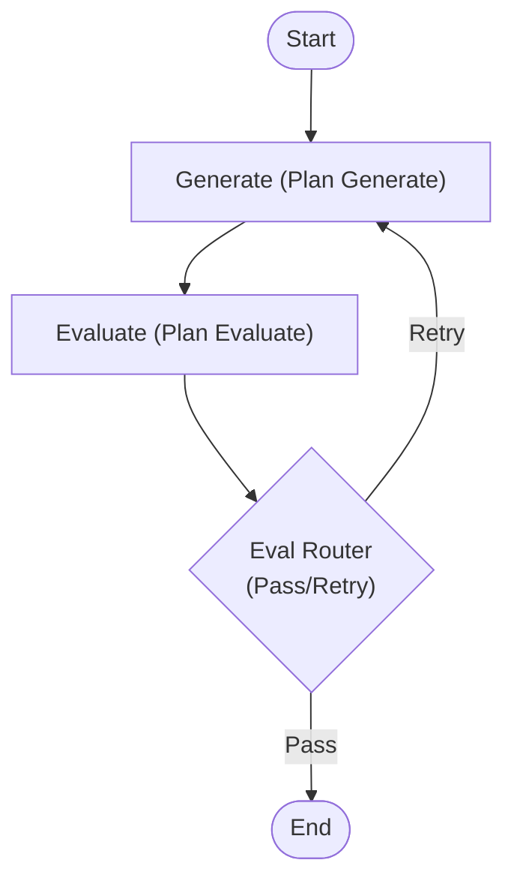
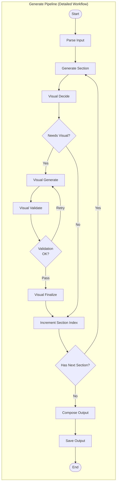

# Graph Module

이 디렉토리는 LangGraph 기반의 워크플로우 그래프들을 정의합니다.

## Plan Pipeline Graph (`plan_graph.py`)

기획서 생성 에이전트의 핵심 실행 흐름을 정의합니다.

### 1. High-Level Flow

전체 파이프라인의 핵심 흐름입니다. Global State를 기반으로 기획서를 생성하고 평가합니다.

### 2. Input / Output

| 구분 | 설명 | 데이터 구조 |
|------|------|-------------|
| **Input** | 기획서 작성을 위한 기본 정보 및 Blueprint *(파이프라인 내부에서 `structured_input`으로 변환)* | `state.get("idea")` `state.get("blueprint")` |
| **Output** | 생성된 기획서 섹션, 시각화 결과물, 마크다운 파일 경로 | `state["plan_output"]` |

#### Input Detail
- **idea**: 기획 의도(`rationale`), 기획 스타일(`planning_style`), 목차(`toc`) 등의 정보
- **blueprint**: 각 섹션별 작성 가이드라인 및 참조 정보

#### Output Detail
- **sections**: 생성된 기획서의 각 섹션 내용
- **visual_artifacts**: 표, 다이어그램 등 생성된 시각화 자료
- **final_markdown**: 최종 조합된 마크다운 텍스트
- **output_path**: 저장된 파일 경로

---

### 3. Detailed Workflow

`Generate` 노드 내부에서 실행되는 상세 파이프라인(Pipeline Graph)입니다.

### Components Description

#### Global Graph Elements
- **Generate**: 상세 파이프라인(`Plan Pipeline`)을 호출하여 기획서를 생성합니다.
- **Evaluate**: 생성된 결과물의 품질을 평가합니다. (현재는 기본 통과 로직)
- **Eval Router**: 평가 결과에 따라 `pass` 또는 `retry`를 결정합니다.

#### Pipeline Elements
- **Parse Input**: Global State의 입력을 파이프라인 전용 State로 변환합니다.
- **Generate Section**: Blueprint에 정의된 가이드라인을 따라 섹션을 작성합니다.
- **Visual Process**: 섹션 내용에 적합한 시각화(표, 다이어그램 등)를 결정하고 생성합니다.
- **Compose & Save**: 모든 섹션을 조합하여 마크다운 파일로 저장합니다.
