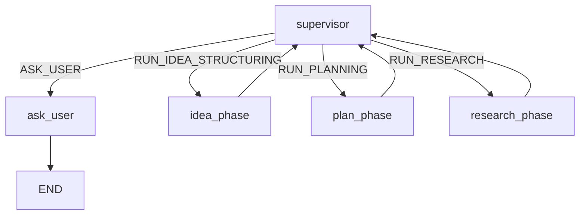
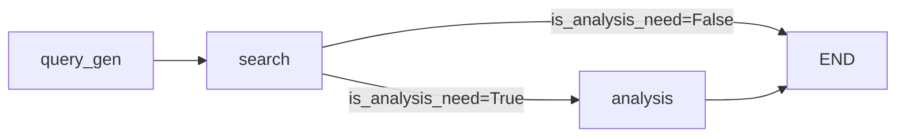

# Graph 모듈 문서

> **최종 업데이트**: 2026-02-08  
> **작성자**: 디버깅 세션 중 자동 생성

---

## 개요

이 폴더는 LangGraph 기반 상태 그래프 정의를 포함합니다. 각 서브그래프는 특정 에이전트의 워크플로우를 정의합니다.

---

## 파일 구조

| 파일 | 담당 에이전트 | 협업 필요 |
|------|---------------|-----------|
| `supervisor_graph.py` | Supervisor | ⚠️ **협업 필수** |
| `research_graph.py` | Research | ⚠️ **협업 필수** |
| `idea_graph.py` | Idea | ⚠️ **협업 필수** |
| `plan_graph.py` | Plan | 개인 작업 |
| `edit_graph.py` | Edit | 개인 작업 |
| `visual_graph.py` | Visual | 개인 작업 |

---

## Supervisor Graph (`supervisor_graph.py`)

### 역할
모든 에이전트를 조율하는 최상위 그래프입니다.

### 주요 변경 사항 (2026-02-08)

#### 1. Research 노드 추가
```python
# 기존 (BEFORE)
supervisor_graph.add_node("idea_phase", idea_subgraph)
supervisor_graph.add_node("plan_phase", plan_subgraph)

# 변경 후 (AFTER)
supervisor_graph.add_node("idea_phase", idea_subgraph)
supervisor_graph.add_node("plan_phase", plan_subgraph)
supervisor_graph.add_node("research_phase", run_research_for_plan)  # 신규
```

#### 2. 라우팅 경로 추가
```python
supervisor_router → {
    "ASK_USER": "ask_user",
    "RUN_IDEA_STRUCTURING": "idea_phase",
    "RUN_PLANNING": "plan_phase",
    "RUN_RESEARCH": "research_phase",  # 신규
    "supervisor_node": "supervisor"
}
```

### 흐름도



---

## Research Graph (`research_graph.py`)

### 역할
Tavily 검색을 통해 외부 정보를 수집하고 분석합니다.

### 주요 구성 요소

#### 서브그래프 (`research_subgraph`)


| 노드 | 함수 | 역할 |
|------|------|------|
| `query_gen` | `generate_queries()` | 검색 쿼리 생성 |
| `search` | `search_with_tavily()` | Tavily 검색 실행 |
| `analysis` | `analysis_search_results()` | 검색 결과 분석 |

#### 래퍼 함수 (`run_research_for_plan`)

Plan Agent와 연동하기 위한 **GlobalState ↔ ResearchState 변환** 래퍼입니다.

**입력 (GlobalState):**
```python
state['research'] = {
    'queries': ['쿼리1', '쿼리2', ...],
    'section_context': '1. 서비스 개요',
    'needs_research': True
}
```

**출력 (GlobalState):**
```python
state['research'] = {
    'queries': [...],
    'section_context': '...',
    'needs_research': False,  # 변경됨
    'evidence_store': ['검색결과1', '검색결과2', ...],  # 추가됨
    'analysis_result': '분석 결과 텍스트'  # 추가됨
}
```

---

## 연동 시 주의사항

### Plan → Research 연동

1. **Plan Agent**가 `needs_research: True`를 설정하면
2. **Supervisor**가 `RUN_RESEARCH`로 라우팅
3. **Research Agent**가 검색/분석 수행
4. 결과가 `state['research']['evidence_store']`에 저장
5. **Plan Agent**가 다시 호출되어 리서치 결과를 프롬프트에 포함

### GlobalState 필드 의존성

| 필드 | 설정 주체 | 사용 주체 |
|------|-----------|-----------|
| `research.queries` | Plan Agent | Research Agent |
| `research.section_context` | Plan Agent | Research Agent |
| `research.needs_research` | Plan Agent → Research Agent | Supervisor |
| `research.evidence_store` | Research Agent | Plan Agent |
| `research.analysis_result` | Research Agent | Plan Agent |

---

## 변경 이력

| 날짜 | 변경 내용 | 관련 파일 |
|------|-----------|-----------|
| 2026-02-08 | Research 노드 추가, 라우팅 확장 | `supervisor_graph.py` |
| 2026-02-08 | `run_research_for_plan` 래퍼 추가 | `research_graph.py` |
